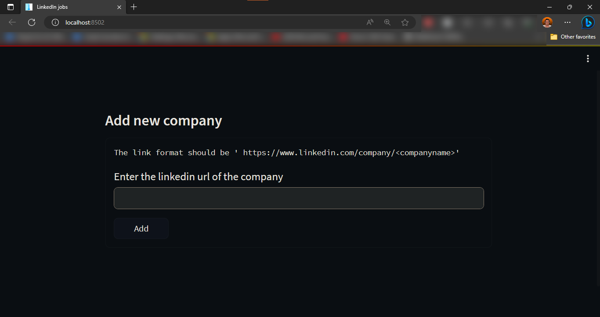

# LinkScrappy: Your personalized Linkedin Job Scrapper

## Introduction
Are you tired of regularly checking Linkedin pages of companies for  newly post jobs?

Link Scrappy is your answer!

All you need is to provide the link of the company's linkedin page, and it will automatically scrap newly posted jobs for you and save them in your personalized job portal

## Setup Instructions
1. You must have python installed on your computer.
2. You must have a chrome webdriver installed on your compter, you can follow the instructions in [this video](https://www.youtube.com/watch?v=WnWQgUerR0c) to setup a chrome webdriver on your computer.
3. Clone the repo using the following command 
   
   `git clone https://github.com/BilalAhmed-358/LinkedIn-Job-Scrapper.git`
4. Create a new file 'credentials.txt' inside the root of the folder

   

5. Type the email of your linkedin account on the first line of the file and the password on the second line of the file 
   
   

6. Set up a virtual environment on windows by running the following commands:
   
   `python -m venv env`

   Here `env` is the name of our virtual environment

7. Now lets activate our virtual environment
   
   `.\env\Scripts\Activate`

8. Install all the dependencies required for the project
   
   `pip install -r .\requirements.txt`

9. Run the app using the following command

   `streamlit run .\ui.py`

10. The app's homepage looks like this
    
    

11. Paste/Type the url of the company you want to scrap jobs for, keep in mind that the format of the link should be in the following format
    
   `https://www.linkedin.com/company/<companyname>`

   and hit `Enter` key

12. The webdriver may require you to bypass the linkedin human detection check which you'll have to perform manually.
